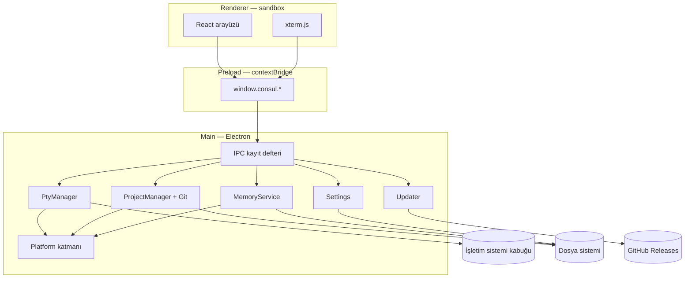
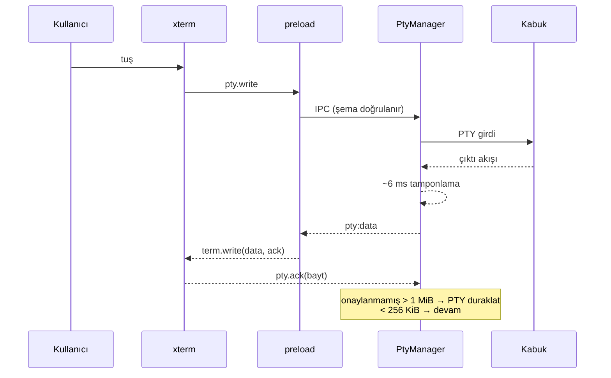
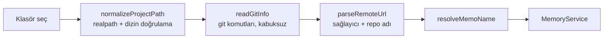
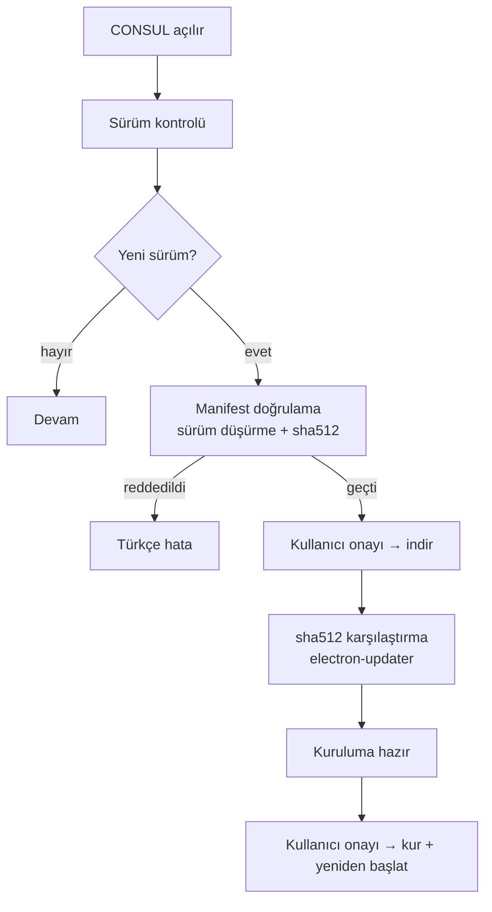
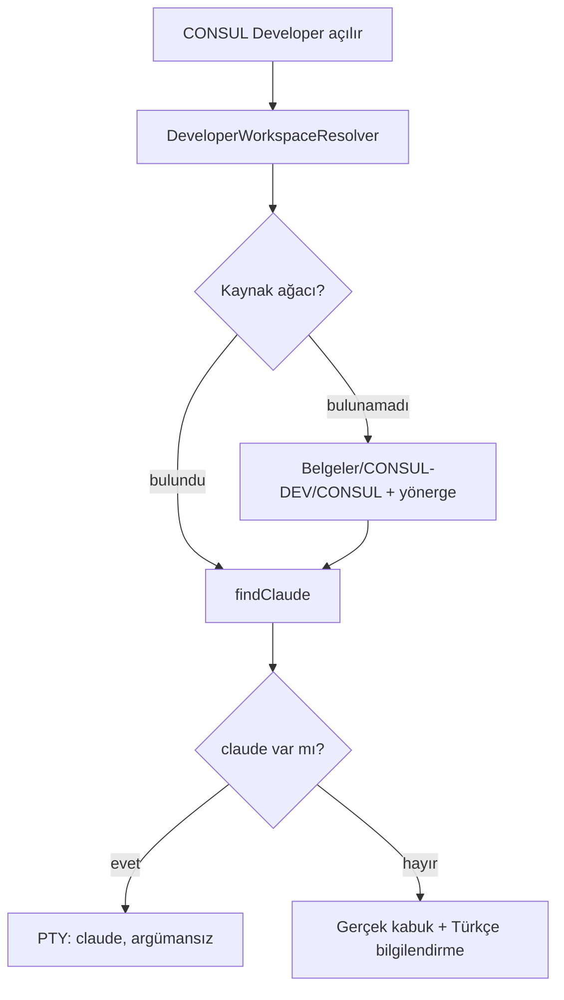

# CONSUL Mimarisi

## Katmanlar



Renderer'ın Node'a, dosya sistemine ya da keyfi IPC kanallarına erişimi yoktur.
Tek kapı preload'daki tipli yüzeydir; her istek main tarafında hem **gönderen**
hem **şema** doğrulamasından geçer.

---

## Uygulama katmanı

Tek paket iki bağımsız uygulama barındırır (`src/main/app/mode.ts`):

| Mod | Açılış | Pencere | `userData` |
|---|---|---|---|
| CONSUL | varsayılan | sekmeli terminal | `<appData>/CONSUL` |
| CONSUL Developer | `--developer` | tek terminal | `<appData>/CONSUL Developer` |

Ayrı süreç, ayrı veri dizini, ayrı tek-örnek kilidi. Biri çökerse diğeri etkilenmez.

---

## Terminal katmanı



Tasarım kararları:

- **Emülatör ile süreç ayrıdır.** `xterm` yalnız çizer; `node-pty` yalnız süreç
  yönetir. İkisi arasında React yoktur.
- **Komut satırı string'i kurulmaz.** `terminal/launcher.ts`, keşfedilmiş kabuk
  kaydından `{file, args[]}` üretir. Kullanıcı girdisi hiçbir zaman bir komut
  metnine gömülmez.
- **Oturum izolasyonu.** Spawn hatası tipli `PtyError` olarak döner; süreç düşmez.

---

## Platform katmanı

`process.platform` kontrolü **yalnız** `src/main/platform/` içinde bulunur.

| Modül | Sorumluluk |
|---|---|
| `os.ts` | platform kimliği, PATH ayracı, çalıştırılabilir uzantıları |
| `paths.ts` | Belgeler / userData / home / hızlı erişim (Electron API'si) |
| `pathUtils.ts` | ad temizleme, yol hapsi — **Electron'suz, test edilebilir** |
| `executables.ts` | PATH + platforma özgü konumlarda çalıştırılabilir arama |
| `shells.ts` | kabuk keşfi (PowerShell/cmd/Git Bash/WSL, POSIX kabukları) |

Kabuk keşfi kabuk çalıştırmaz: PATH dizinleri doğrudan taranır — hem daha
hızlıdır hem enjeksiyon yüzeyi bırakmaz.

---

## Proje yönetimi



Git kurulu değilse ya da klasör repository değilse proje yine tam çalışır;
Git bilgisi yalnızca "yok" olarak gösterilir.

---

## Hafıza sistemi (CONSUL-MEMO)

Ayrıntı: [CONSUL-MEMO.md](CONSUL-MEMO.md).

```
MemoryService (memory/index.ts)
├── ProjectResolver        projects/index.ts
├── RepositoryResolver     projects/repository.ts
├── MemoDirectoryManager   memory/memoDirectory.ts
├── ChangelogManager       memory/markdown.ts (appendChangelog)
├── PurposeManager         memory/documents.ts
├── ArchitectureManager    memory/documents.ts
└── ElementRegistry        memory/documents.ts + memory/projectFacts.ts
```

Servis UI'dan bağımsızdır ve doğrudan test edilir (`tests/memory.test.ts`).

---

## Ayarlar

`settings/index.ts` atomik JSON deposu kullanır: tmp + fsync + rename, iki nesil
yedek, bozulma kurtarma. Geçici IO hatasında **varsayılana düşülmez** —
`TransientReadError` fırlar, bir tur atlanır, kullanıcının ayarları korunur.
Her yama şemadan geçer; bilinmeyen alan atılır, aralık dışı değer reddedilir.

---

## Güncelleme sistemi

Ayrıntı: [UPDATER.md](UPDATER.md).



---

## CONSUL Developer



`DeveloperWorkspaceResolver` **asla** imzalı/salt-okunur uygulama paketinin
içine yazmaz: `.app` bundle'ı, AppImage montaj noktası ve `resourcesPath`
aday listesinden elenir.

---

## Veri akışı özeti

| Yol | Nereye yazılır |
|---|---|
| Ayarlar | `<userData>/settings.json` |
| Developer çalışma alanı kaydı | `<userData>/developer-workspace.json` |
| Proje hafızası | `<Belgeler>/CONSUL-MEMO/<repo>/` |
| Hafıza indeksi | `<Belgeler>/CONSUL-MEMO/.consul-index.json` |
| Güncelleme önbelleği | electron-updater'ın kendi dizini |

CONSUL başka hiçbir yere yazmaz ve telemetri göndermez.
