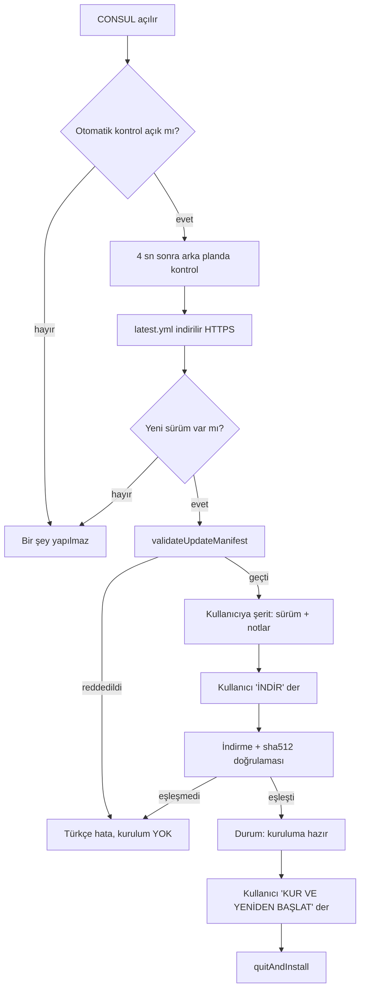

# Otomatik Güncelleme

CONSUL, yeni bir sürüm GitHub Releases'e yayınlandığında bunu algılar ve
kullanıcı onayıyla kurar. Altyapı `electron-updater`'dır (electron-builder'ın
resmî updater'ı) — çerçeve değiştirilmeden, ekosistemin standart yolu kullanılır.

## Akış



**Hiçbir adım otomatik değildir**: indirme de kurulum da kullanıcının açık
onayını bekler. `autoInstallOnAppQuit` kapalıdır — uygulama kapanırken sessizce
kurulum yapılmaz.

## Güvenlik katmanları

| Katman | Ne yapar | Nerede |
|---|---|---|
| HTTPS | manifest ve artefakt yalnız TLS üzerinden iner | electron-updater |
| sha512 | indirilen dosyanın özeti `latest.yml`deki değerle karşılaştırılır; eşleşmezse kurulum iptal | electron-updater (**devre dışı bırakılmaz**) |
| Sürüm düşürme reddi | sunulan sürüm kuruludan yeni değilse reddedilir | `updater/version.ts` |
| Manifest bütünlüğü | sha512 alanı olmayan yayın "doğrulanamaz" sayılır ve reddedilir | `updater/version.ts` |
| Kanal disiplini | kararlı kanalda ön-sürüm kurulmaz | `updater/version.ts` |
| Yayıncı doğrulaması | Windows'ta uygulama **kod imzalıysa** yayıncı adı da doğrulanır | electron-updater |

Son satır önemlidir: **imzasız dağıtımda yayıncı doğrulaması yoktur.** Bu bilinçli
ve dokümante edilmiş bir sınırdır — bkz. [SIGNING.md](SIGNING.md). Sahte bir
imzalama katmanı uydurulmamıştır.

## Kullanıcı deneyimi

- Yeni sürüm bulunduğunda üstte bir şerit çıkar: sürüm numarası + kısa yayın notu.
- "SONRA" denirse şerit kapanır, çalışma bölünmez.
- Çalışan terminal oturumu varken kurulum önerisi bunu açıkça söyler; süreçler
  veri kaybına yol açacak biçimde zorla kapatılmaz.
- Ayarlar → Güncelleme'den elle kontrol edilebilir, otomatik kontrol kapatılabilir.

## Kanallar

| Kanal | Davranış |
|---|---|
| `stable` (varsayılan) | yalnız kararlı sürümler (`1.2.0`) |
| `beta` | ön-sürümler de (`1.2.0-beta.1`) |

Beta kanalı için yayının GitHub'da **prerelease** işaretli olması gerekir.

## Geliştirme modu

`app.isPackaged` false iken güncelleme akışı çalıştırılmaz; durum
`unsupported` olur ve arayüz bunu açıkça söyler. Sahte bir "güncelleme var"
davranışı üretilmez.

## Yapılandırma

`electron-builder.yml` içindeki `publish` bloğu derleme sırasında
`app-update.yml` dosyasına gömülür:

```yaml
publish:
  - provider: github
    owner: <github-kullanıcısı>
    repo: CONSUL
    releaseType: release
```

`owner` alanı yayın öncesi doldurulmalıdır; yanlış bırakılırsa kurulu uygulama
güncelleme bulamaz (çökmez, yalnız "güncelleme bulunamadı" der).

## Sorun giderme

| Belirti | Sebep |
|---|---|
| "Güncelleme sunucusuna ulaşılamadı" | ağ/DNS/proxy |
| "Yayınlanmış bir güncelleme bulunamadı" | `publish.owner`/`repo` yanlış ya da Release yok |
| "Bütünlük doğrulaması başarısız" | artefakt bozuk veya `latest.yml` ile uyumsuz — **kurulum iptal edildi, bu doğru davranıştır** |
| "Sunulan sürüm kurulu sürümden yeni değil" | eskitilmiş/yanlış manifest |
| "Güncelleme yalnızca kurulu sürümde çalışır" | geliştirme modundasın |
